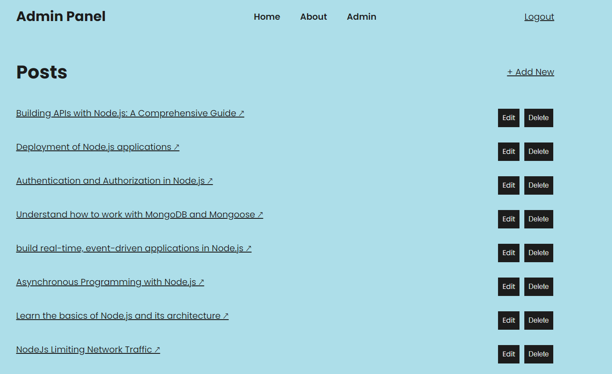

# 📝 Blog Website with Authentication and Search

Welcome to our Blog Website! This project is a feature-rich blog platform built with Node.js, Express, MongoDB, and Handlebars. Users can authenticate using GitHub or Google, and search posts using keywords.

## 🌐 Live Demo
Check out the live site [here](http://your-live-site-url.com).

## 📖 Description
This blog website allows users to create, edit, and delete posts. Only authenticated users can perform these actions, ensuring a secure and personalized experience. The application includes the following features:

- User authentication with GitHub and Google
- Search functionality to find posts by keywords
- Secure session management with MongoDB store
- Admin page to manage users and posts

## 🛠️ Features

### 🔍 Search with Keywords
Users can search for posts by entering keywords in the search bar. The search functionality scans through the post titles and content to find matching entries, making it easy to locate specific posts.

### 🔑 Login with GitHub and Google
The website provides seamless login options using GitHub and Google OAuth. This ensures a quick and secure login process without the need to remember another password.

## 🚀 Getting Started
To get a local copy up and running, follow these simple steps:

### Prerequisites
- Node.js installed on your local machine
- MongoDB database setup

### Installation

1. **Clone the repo**

    ```sh
    git clone https://github.com/SUKH2022/COMP2068JSFrameworks
    ```

2. **Install NPM packages**

    ```sh
    npm install
    ```

3. **Create a `.env` file in the root directory and add the following**

    ```env
    MONGODB_URI=your_mongo_db_uri
    JWT_SECRET=Secret
    GITHUB_CLIENT_ID=your_github_client_id
    GITHUB_CLIENT_SECRET=your_github_client_secret
    GOOGLE_CLIENT_ID=your_google_client_id
    GOOGLE_CLIENT_SECRET=your_google_client_secret

    ```

4. **Start the server**

    ```sh
    npm start dev
    ```

## 📷 Screenshots

### Home Page


### Dashboard


### Search Feature

